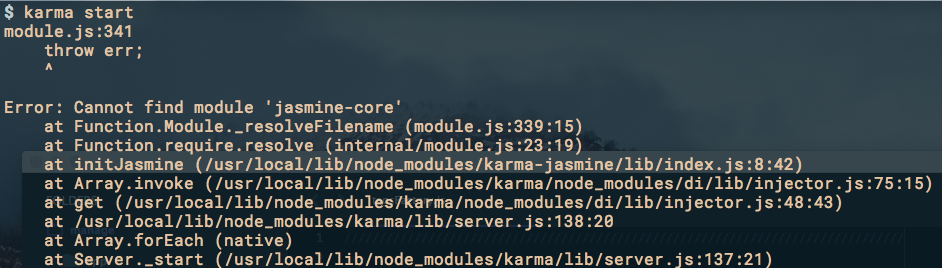

## 搭建Karma+Jasmine的自动化单元测试

>最近在打算将以前的代码进行重构，过程中发现自己不写自动化测试代码，而是手动的写，这样并不好，所以就学了Karma+Jasmine的自动化单元测试，以后写代码尽量要写自动化单元测试，也要测一下stanbul代码覆盖率。

据我了解，Nodejs领域: Jasmine做单元测试，Karma自动化完成单元测试，Grunt启动Karma统一项目管理，Yeoman最后封装成一个项目原型模板，npm做nodejs的包依赖管理，bower做javascript的包依赖管理。

### Karma的介绍

Karma是一个基于Node.js的JavaScript测试执行过程管理工具（Test Runner）。该工具可用于测试所有主流Web浏览器，也可集成到CI（Continuous integration）工具，也可和其他代码编辑器一起使用。这个测试工具的一个强大特性就是，它可以监控(Watch)文件的变化，然后自行执行，通过console.log显示测试结果。

### Karma的安装
我的开发环境：
- win7 64bit,
- node v8.11.2
- npm 5.6.0

1、全局安装karma、Jasmine-core、Karma-Jasmine
```
npm install -g karma
npm install -g Jasime-core 
npm install -g karma-Jasmine
```
2、局部局安装karma、Jasmine-core、Karma-Jasmine
```
npm install --save-dev karma
npm install --save-dev Jasime-core 
npm install --save-dev karma-Jasmine
```
3、测试是否安装成功
```
karma start
```

4、Karma + Jasmine配置
```
karma init
```


### 自动化单元测试
1). 创建源文件：用于实现某种业务逻辑的文件，就是我们平时写的js脚本
有一个需求，要实现单词倒写的功能。如：”ABCD” ==> “DCBA”

```
//src/index.js
function reverse(word){
    return word.split("").reverse().join("");
}
```
2). 创建测试文件：符合jasmineAPI的测试js脚本
```
//test/test.js
describe("A suite of basic functions", function() {
    it("reverse word",function(){
        expect("DCBA").toEqual(reverse("ABCD"));
    });
});
```
3). 修改karma.conf.js配置文件
我们这里需要修改：files和exclude变量
```
files: ['./src/*.js'],
exclude: ['karma.conf.js'],
```
4). 启动karma
单元测试全自动执行
```
karma start karma.conf.js
```

### Karma和istanbul代码覆盖率
1、全局安装istanbul依赖karma-coverage
```
npm install -g karma-coverage
```
2、局部安装istanbul依赖karma-coverage
```
npm install --save-dev karma-coverage
```
3、修改karma.conf.js配置文件

reporters: ['progress','coverage'],
preprocessors : {'src.js': 'coverage'},
coverageReporter: {
    type : 'html',
    dir : 'coverage/'
}
4、启动karma start

在工程目录下面找到index.html文件，coverage/chrome/index.html


接下来，我们修改src.js，增加一个if分支

```
function reverse(word){
    if(word=='AAA') return "BBB";
    return word.split("").reverse().join("");
}
```

再看覆盖率报告，下降得有点恐怖


### 出现的坑
千万记住要先全局安装再局部安装，不然老是报错：jasmine-core模块未找到


参考：
[Error: Cannot find module 'jasmine-core'](https://stackoverflow.com/questions/35993875/error-cannot-find-module-jasmine-core/35994050)